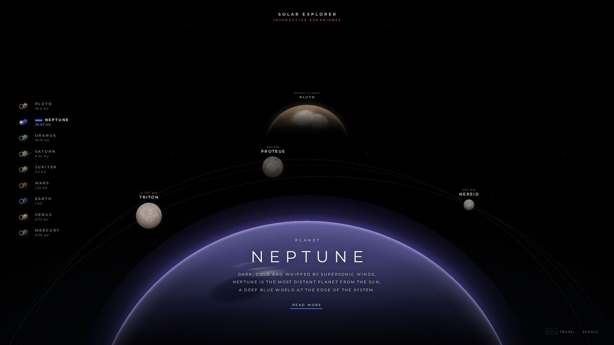
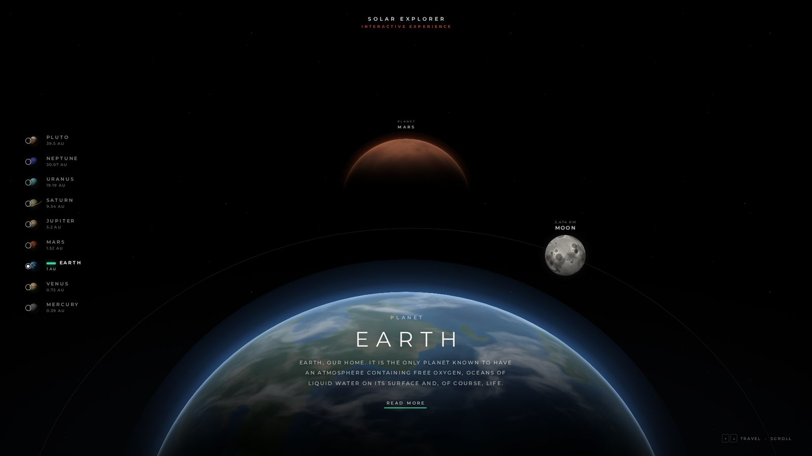
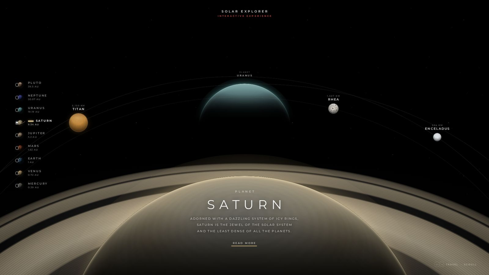

# Solar System Explorer

**Uma experiência visual e interativa para explorar os planetas do Sistema Solar.**
Escura, minimalista e cinematográfica: planetas gigantes no horizonte, luas sobre órbitas discretas e uma câmera que *viaja* em profundidade entre os mundos.



<table>
  <tr>
    <td></td>
    <td></td>
  </tr>
</table>

---

## Sobre o projeto

O **Solar System Explorer** recria, do zero, a experiência de um "planetário digital": o planeta selecionado aparece enorme na parte inferior da tela, mostrando apenas a sua curvatura, como se estivéssemos em órbita logo acima dele. O próximo planeta espera pequeno, ao longe. Ao escolher outro mundo, a câmera atravessa o sistema, passando pelos planetas intermediários, até se aproximar do destino.

### Objetivo

- Reproduzir a composição de um explorador espacial: fundo preto, horizonte planetário, planeta distante acima, órbitas, luas e tipografia elegante.
- Usar **CSS 3D de verdade** (`perspective`, `translateZ`, `transform-style: preserve-3d`) para criar profundidade real, e não planetas 2D soltos na tela.
- Manter **JavaScript apenas onde é necessário**: navegação, estado, troca de conteúdo, a animação da câmera e acessibilidade.

## Funcionalidades

- **9 corpos celestes**: Mercúrio, Vênus, Terra, Marte, Júpiter, Saturno, Urano, Netuno e Plutão, cada um com aparência, cores, tamanho, iluminação, atmosfera e brilho próprios.
- **Planeta em horizonte**: o planeta ativo ocupa a parte inferior da tela, iluminado por trás, com borda brilhante (*rim light*) e lado noturno mergulhando no escuro.
- **Planeta distante**: o próximo planeta aparece acima, menor e mais alto, com um pequeno rótulo.
- **Viagem pela câmera**: a troca de planeta é um voo em profundidade. O conteúdo atual se desfaz, a câmera passa pelos planetas intermediários (com o nome de cada um surgindo no centro), o destino cresce em aproximação e o título pousa sobre o horizonte.
- **Revelação em etapas**: título → órbitas → luas (uma a uma) → descrição → *READ MORE*.
- **Órbitas e luas**: elipses finas e discretas; as luas ficam sobre as órbitas, com nome e diâmetro, e derivam lentamente.
  Lua · Fobos e Deimos · Io, Europa, Ganimedes e Calisto · Titã, Reia e Encélado · Miranda, Titânia e Oberon · Tritão, Proteu e Nereida · Caronte, Nix e Hidra.
- **Anéis de Saturno em perspectiva**: disco 3D (`rotateX` + `perspective`) dividido em metade traseira (atrás do planeta) e dianteira (à frente), com divisão de Cassini, anéis C/B/A e transparências. À distância os anéis ficam quase de perfil; ao chegar, eles se abrem e se erguem sobre o horizonte.
- **Menu lateral** no estilo da referência: anel de seleção, miniatura do planeta, nome, distância em UA, estados normal, *hover*, foco e selecionado (barra na cor do planeta).
- **Painel READ MORE**: painel lateral (sem sair da página) com descrição completa, diâmetro, distância, período orbital, duração do dia, temperatura, gravidade, número de luas, luas principais e uma curiosidade.
- **Animação de entrada**: a cena surge do escuro enquanto a câmera se aproxima da Terra.
- **Links diretos**: `index.html#saturn` abre direto em Saturno; a URL acompanha a navegação.

## Tecnologias

| Camada | Uso |
| --- | --- |
| **HTML5** | Estrutura semântica: `header`, `nav`, `fieldset` com `input[type=radio]`, `main`, `dialog`. |
| **CSS3** | Toda a parte visual: perspectiva 3D, iluminação com `radial-gradient`/`linear-gradient`, `box-shadow` interno, máscaras, `mix-blend-mode`, transições e *keyframes*. |
| **JavaScript (vanilla)** | Monta a cena a partir dos dados, move a câmera com `requestAnimationFrame` **somente durante as viagens**, gerencia estado, teclado, rolagem, toque e o painel. |
| **Python (opcional)** | `tools/generate_textures.py` gera as texturas procedurais dos planetas e luas (NumPy + Pillow). |

Sem frameworks, sem bundler, sem dependências em tempo de execução.

## Como funciona a profundidade

```
.space   → perspective: 1000px; perspective-origin: 50% 18%   (a "lente")
 └ .system → transform-style: preserve-3d; translateZ(câmera)    (o "trilho" da câmera)
    ├ .body--mercury  translateZ(0)
    ├ .body--venus    translateZ(-GAP)
    ├ .body--earth    translateZ(-2·GAP)
    └ …
```

- Cada corpo fica em sua própria profundidade. O ponto de fuga fica perto do topo, então os corpos mais distantes encolhem e **sobem** na tela. É assim que o próximo planeta aparece "acima" do atual.
- `GAP` é calculado para que o próximo planeta tenha 27% do tamanho real: `P / (P + GAP) = 0.27`.
- A câmera é um único `translateZ` em `.system`. Durante a viagem, o JavaScript atualiza essa posição e a opacidade de cada corpo, que somem ao passar pela câmera e esmaecem na distância.
- Iluminação, atmosferas, anéis, órbitas, luas e a revelação em etapas são 100% CSS, acionados por classes de estado (`is-departing`, `is-arrived`, `is-current`).
- As luas são posicionadas a partir de coordenadas em "raios do planeta"; o JavaScript calcula a elipse que passa por cada uma e ajusta tudo ao tamanho da tela (nada fica cortado nem embaixo do menu).

## Estrutura

```
/
├── index.html
├── css/
│   ├── style.css          # tokens, layout, cabeçalho, menu, textos, painel
│   ├── planets.css        # cena 3D, esferas, iluminação, atmosferas, anéis, órbitas, luas
│   ├── animations.css     # estados e coreografia das transições, reduced motion
│   └── responsive.css     # notebooks, tablets, celulares (retrato e paisagem)
├── js/
│   ├── planets.js         # dados dos planetas e luas
│   └── app.js             # câmera, estado, navegação, painel, acessibilidade
├── assets/
│   ├── planets/           # superfícies (WebP 2048 px) + thumbs/ para o menu
│   ├── moons/             # superfícies das luas
│   └── fonts/             # Montserrat (variável, auto-hospedada) + licença OFL
├── tools/
│   └── generate_textures.py
├── docs/                  # imagens do README
├── README.md
└── .gitignore
```

## Como executar

Não há build. Basta abrir o `index.html` no navegador.

Para usar um servidor local (recomendado):

```bash
# com Node.js
npx serve .

# ou com Python
python3 -m http.server 8080
```

Depois acesse `http://localhost:8080` (ou a porta indicada).

### Regenerar as texturas (opcional)

As texturas já estão no repositório. Para alterá-las:

```bash
pip install numpy pillow
python3 tools/generate_textures.py            # tudo
python3 tools/generate_textures.py earth io   # apenas alguns corpos
```

As superfícies são geradas com ruído Perlin 3D avaliado sobre a própria esfera (sem emendas nem distorção nos polos) e salvas já em projeção esférica, sem luz: a iluminação fica a cargo do CSS.

## Controles

| Ação | Como |
| --- | --- |
| Escolher um planeta | Clique no menu lateral (ou na faixa superior, no celular) |
| Viajar para fora / para dentro | `↑` / `↓` ou `Page Up` / `Page Down` |
| Ir direto a um planeta | Teclas `1` a `9` (Mercúrio → Plutão) |
| Navegar pelo menu | `Tab` até o menu e setas (botões de rádio nativos) |
| Rolar | Roda do mouse / trackpad (um gesto = um planeta) |
| Celular / tablet | Deslize para cima (para fora) ou para baixo (em direção ao Sol) |
| Mais informações | **READ MORE**; fechar com `Esc`, botão ✕ ou clique fora |
| Link direto | `index.html#jupiter`, `#neptune` etc. |

Se você clicar em outro planeta no meio de uma viagem, a câmera muda de rota a partir de onde está.

## Responsividade

| Tela | Comportamento |
| --- | --- |
| **1920×1080 e maiores** | Composição completa, como na referência. |
| **Notebooks (1366×768, 1440×900)** | Mesma composição; tamanhos derivados de `vw`/`vh` mantêm as proporções. |
| **Tablets e telas em retrato** | O menu vertical vira uma faixa horizontal rolável no topo; planeta maior em relação à largura; luas reposicionadas para caber. |
| **Celulares em retrato** | Faixa horizontal que centraliza o planeta ativo, horizonte a 60% da altura, textos ajustados; só as luas principais são exibidas, para manter a cena limpa. |
| **Celulares em paisagem** | Menu vertical compacto (sem as distâncias), descrição limitada a duas linhas. |

O layout usa `dvh` (com *fallback* para `vh`), `env(safe-area-inset-*)` e não tem rolagem da página.

## Acessibilidade

- HTML semântico; o seletor de planetas é um grupo de **botões de rádio nativos** (teclado funciona de graça).
- `:focus-visible` em todos os controles; link "pular para o conteúdo".
- `aria-live` anuncia o planeta ao chegar; o título da aba acompanha a navegação.
- O painel usa `<dialog>` modal: o foco vai para o botão de fechar e volta ao **READ MORE**; `Esc` fecha.
- Textos com contraste mínimo de 4,5:1 sobre o fundo preto.
- **`prefers-reduced-motion: reduce`**: sem voo de câmera (troca por *crossfade* curto), sem deriva das luas e transições encurtadas.

## Desempenho

- As animações usam apenas `transform` e `opacity`.
- O `requestAnimationFrame` só roda **durante uma viagem** e para assim que a câmera pousa. Parado, nenhum script fica executando.
- Corpos fora de vista ficam com `visibility: hidden` (não são pintados); a deriva das luas é pausada fora do planeta atual.
- Texturas leves: menos de 1 MB no total (WebP), pré-decodificadas em segundo plano.
- Fonte variável única (~38 KB), auto-hospedada.

## Dados

Os dados ficam em `js/planets.js`: nome, tipo, descrição, textos do painel, diâmetro, distância do Sol, período orbital, duração do dia, temperatura, gravidade, número de luas e as luas exibidas, com posição, órbita e tamanho na cena. Valores aproximados, baseados nas fichas da NASA; contagem de luas conhecidas em 2025.

## Créditos e licenças

- Inspirado no vídeo de referência de um *"Solar Explorer"*. Todo o código, as texturas procedurais e os textos deste repositório foram criados do zero.
- Fonte [Montserrat](https://github.com/JulietaUla/Montserrat), sob a SIL Open Font License 1.1 (`assets/fonts/OFL.txt`).
- Código sob a licença MIT (`LICENSE`).
